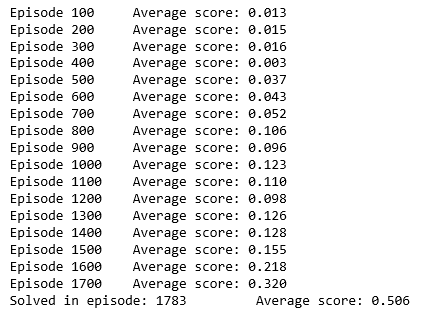
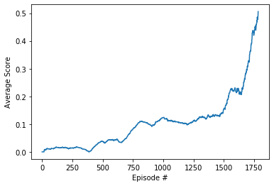

# Report - Project 3 Collaboration and Competition

## Architecture

Actor : State Space | 200 | 150 | Action Space with RELU | RELU | TANH activations respectively.
We define Actor Local and Actor Target in the same way

Critic : State Space + Action Space | 200 | 150 | 1 with RELU | RELU | Linear activations respectively.
We define Critic Local and Critic Target in the same way

## Hyperparameters

BUFFER_SIZE = int(1e5)  # replay buffer size

BATCH_SIZE = 250         # minibatch size

GAMMA = 0.99            # discount factor

TAU = 1e-3              # for soft update of target parameters

LR_ACTOR = 1e-4         # learning rate of the actor

LR_CRITIC = 1e-3        # learning rate of the critic

WEIGHT_DECAY = 0        # L2 weight decay

EXPLORATION_TIME_STEPS = 5000 # Time steps until which the agent will just explore

## Results

## Plots

## Future Work
